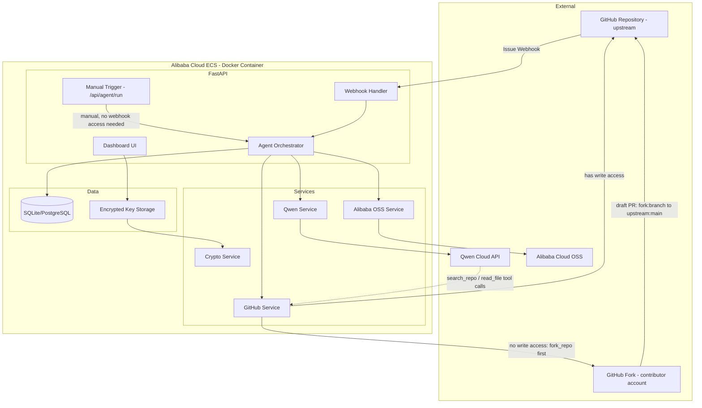

# DevInbox Architecture

## Overview
DevInbox bridges GitHub repositories with Qwen Cloud's AI reasoning to
autonomously turn issues into reviewable pull requests.

## Diagram

> A rendered PNG of this diagram is available at `docs/architecture-diagram.png` for submission forms that don't render Mermaid inline.

## Pipeline
1. **Trigger** — either (a) GitHub sends an `issues` webhook event, signature verified via HMAC-SHA256, with an idempotency check that skips redelivered events for issues that already have a PR; or (b) a manual `POST /api/agent/run` call with `{repo, issue_number}`, used for repositories where DevInbox can't be granted webhook access (e.g. external open-source projects).
2. **Classification** — Qwen Cloud classifies the issue (bug/feature/question/spam/out_of_scope).
3. **Routing** — Non-actionable issues are left alone with no code changes; actionable ones proceed.
4. **Solution generation** — Qwen generates a fix + explanation, using `search_repo`/`read_file` tool calls to inspect the real codebase before proposing changes.
5. **Write-access check** — DevInbox checks whether its GitHub token has direct write access to the target repo.
   - **Yes** — a branch is created directly on the repo.
   - **No** — DevInbox forks the repo into the authenticated account, waits for the fork to become ready, and branches there instead.
6. **Branch + commit + draft PR** — GitHubService commits the changes and opens a **draft** PR — a same-repo PR when working directly, or a cross-repo PR (`fork:branch → upstream:main`) when working from a fork. Diffs and the full pipeline snapshot are archived to Alibaba Cloud OSS.
7. **Human review (HITL)** — A maintainer reviews and comments `/approve`. Approval comments from DevInbox's own authenticated account are ignored, so the agent cannot approve its own work.
8. **Merge** — Once the PR is out of draft and a genuine external approval is detected, the orchestrator merges it automatically.

## Security
- API keys encrypted at rest with Fernet (AES-256), key derived via PBKDF2 from `SECRET_KEY`.
- Dashboard auth via JWT stored in an HTTP-only cookie.
- GitHub webhook payloads verified via HMAC-SHA256 signature.
- Self-approval is explicitly rejected: a PR cannot be merged by a comment from the same GitHub identity that opened it.
