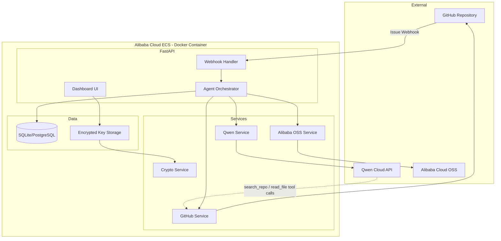

# DevInbox Architecture

## Overview
DevInbox bridges GitHub repositories with Qwen Cloud's AI reasoning to
autonomously turn issues into reviewable pull requests.

## Diagram

> A rendered PNG of this diagram is available at `docs/architecture-diagram.png` for submission forms that don't render Mermaid inline.

## Pipeline
1. **Webhook received** — GitHub sends an `issues` event, signature verified via HMAC-SHA256. A idempotency check skips redelivered events for issues that already have a PR.
2. **Classification** — Qwen Cloud classifies the issue (bug/feature/question/spam/out_of_scope).
3. **Routing** — Non-actionable issues are closed with an explanation; actionable ones proceed.
4. **Solution generation** — Qwen generates a unified diff + explanation, using `search_repo`/`read_file` tool calls to inspect the real codebase before proposing changes.
5. **Branch + commit + draft PR** — GitHubService creates a branch, commits changes, opens a **draft** PR. Diffs and the full pipeline snapshot are archived to Alibaba Cloud OSS.
6. **Human review (HITL)** — A maintainer reviews and comments `/approve`.
7. **Merge** — The orchestrator detects the approval comment and merges the PR.

## Security
- API keys encrypted at rest with Fernet (AES-256), key derived via PBKDF2 from `SECRET_KEY`.
- Dashboard auth via JWT stored in an HTTP-only cookie.
- GitHub webhook payloads verified via HMAC-SHA256 signature.
